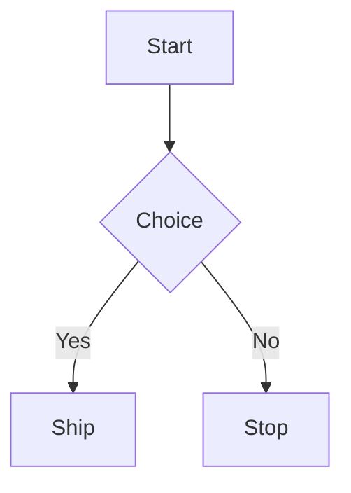

# beautiful-mermaid-terminal-flowcharts: basic example

## Mermaid source



## Render from stdin

```bash
cat <<'EOF' | python3 /absolute/path/to/skills/beautiful-mermaid-terminal-flowcharts/scripts/render_beautiful_mermaid_flowchart.py
flowchart TD
  A[Start] --> B{Choice}
  B -->|Yes| C[Ship]
  B -->|No| D[Stop]
EOF
```

## Render from file

```bash
python3 /absolute/path/to/skills/beautiful-mermaid-terminal-flowcharts/scripts/render_beautiful_mermaid_flowchart.py diagram.mmd
```

## ASCII-only borders

```bash
python3 /absolute/path/to/skills/beautiful-mermaid-terminal-flowcharts/scripts/render_beautiful_mermaid_flowchart.py --ascii diagram.mmd
```
