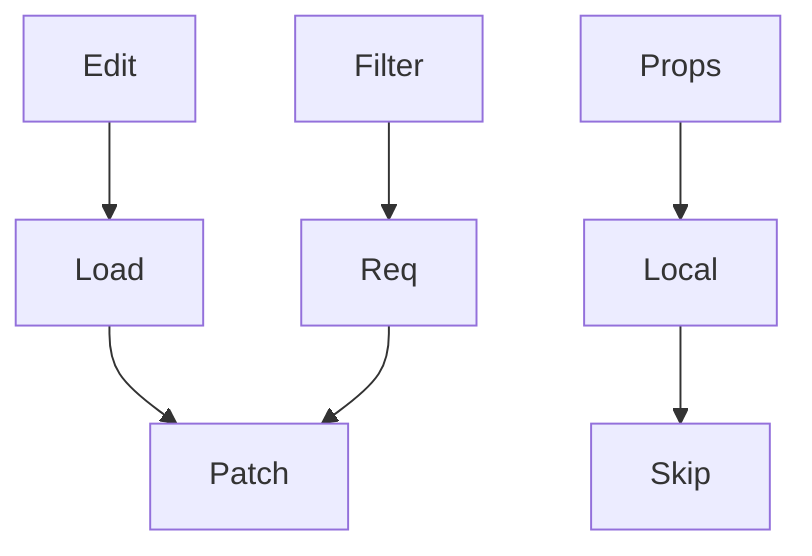

# beautiful-mermaid-terminal-flowcharts: Chinese-safe alias example

## Why this pattern exists

`beautiful-mermaid` is a better fit than the deleted termaid skill for this repo's new terminal flowchart workflow, but it still does not document strict CJK terminal cell-width guarantees.

If the user cares about readable Chinese more than preserving raw labels inside boxes, use short aliases in the diagram and put the full Chinese text in a legend.

## Mermaid source



## Legend

- `Edit`: `editReport` 模式
- `Load`: 首次装载内容
- `Filter`: 筛选器变化
- `Req`: `requestData`
- `Props`: 普通 `props` 编辑
- `Local`: 仅本地更新
- `Patch`: `data patch` 回写
- `Skip`: 跳过重复刷新

## Render command

```bash
cat <<'EOF' | python3 /absolute/path/to/skills/beautiful-mermaid-terminal-flowcharts/scripts/render_beautiful_mermaid_flowchart.py --ascii
flowchart TD
  Edit[Edit] --> Load[Load]
  Filter[Filter] --> Req[Req]
  Props[Props] --> Local[Local]
  Load --> Patch[Patch]
  Req --> Patch
  Local --> Skip[Skip]
EOF
```
