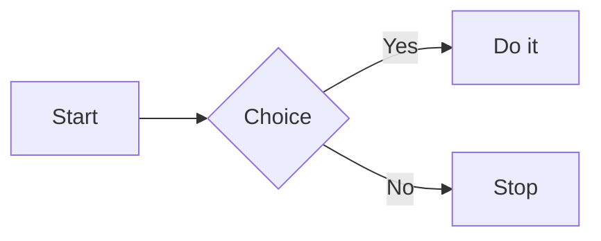

# termaid-terminal-diagrams：基础示例

## Mermaid source



## CLI usage

### Render from file

```bash
cat <<'EOF' > demo.mmd
flowchart LR
  A[Start] --> B{Choice}
  B -->|Yes| C[Do it]
  B -->|No| D[Stop]
EOF

termaid demo.mmd
```

### ASCII-only terminal

```bash
termaid demo.mmd --ascii
```

### Zero-install preview

```bash
uvx termaid demo.mmd
```

### Render from stdin

```bash
cat <<'EOF' | termaid --width 100
flowchart LR
  A[Start] --> B{Choice}
  B -->|Yes| C[Do it]
  B -->|No| D[Stop]
EOF
```

### Theme output

```bash
termaid demo.mmd --theme neon --width 100
```

## Python usage

### Plain string render

```python
from termaid import render

source = """
flowchart LR
  A[Start] --> B{Choice}
  B -->|Yes| C[Do it]
  B -->|No| D[Stop]
"""

print(render(source))
```

### Rich render

```python
from rich import print as rprint
from termaid import render_rich

source = """
flowchart LR
  A[Start] --> B{Choice}
  B -->|Yes| C[Do it]
  B -->|No| D[Stop]
"""

rprint(render_rich(source, theme="terra"))
```

## Notes

- 输入必须是 Mermaid 语法，不是任意自然语言。
- 终端不支持 Unicode 盒线时，优先加 `--ascii`。
- 使用 `--theme` 前，先安装 `termaid[rich]`。
- 如果图太宽，可先试 `--width 100`，或进一步配合 `--gap 2 --padding-x 2 --padding-y 1`。
- termaid 支持 flowcharts、sequence diagrams、class diagrams、ER diagrams、state diagrams、block diagrams、git graphs、pie charts、treemaps、mindmaps。
